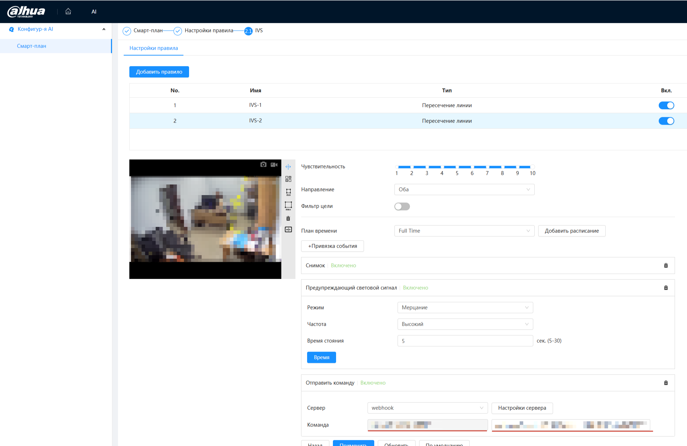
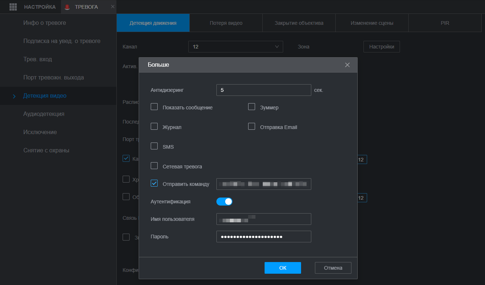

# Max Notify

PHP-сервис для приема webhook-событий от камер Dahua/NVR, получения snapshot и отправки уведомлений с фото в российский мессенджер MAX.

## Что делает сервис

1. Принимает HTTP webhook от Dahua.
2. Проверяет `WEBHOOK_SECRET`.
3. Отсекает дубли событий в течение `DUPLICATE_TTL_SECONDS`.
4. Проверяет временное окно отправки, если оно настроено.
5. Получает snapshot с Dahua/NVR через Digest-авторизацию.
6. Загружает изображение в MAX.
7. Отправляет короткое клиентское сообщение с фото в MAX.
8. Пишет диагностический лог в `storage/logs/webhook.log`.

Фото на сервере не сохраняется: изображение проходит через PHP в памяти и отправляется в MAX.

## Стек

- PHP 8.2/8.3
- Composer
- Nginx
- Docker Compose для локальной разработки
- MySQL + PDO для клиентов, камер и связей между ними
- Bootstrap 5.3.8 для личного кабинета `/profile`
- Symfony VarDumper для разработки

## Структура

```text
public/
  index.php                 HTTP entrypoint
  assets/
    vendor/bootstrap/       локальный Bootstrap

src/
  App.php                   основной поток приложения
  Container/
    Container.php           простой DI/pseudo-container
  Camera/
    CameraRegistry.php      выбор камеры по source
    CameraSource.php        настройки одного источника
    DahuaCamera.php         получение snapshot
    SnapshotResult.php
  Config/
    AppConfig.php           чтение настроек из env
  Database/
    Database.php            подключение к MySQL через PDO
  Event/
    DuplicateGuard.php      защита от дублей
    TimeWindowFilter.php    временной фильтр отправки
  Logger/
    WebhookLogger.php       запись диагностического лога
  Messenger/
    MaxMessenger.php        MAX API client
    CreateUploadResult.php
    UploadImageResult.php
    SendMessageResult.php
  Webhook/
    EventMessageFormatter.php русские тексты событий для MAX
    WebhookRequest.php      разбор входящего запроса
  Profile/
    ProfileController.php   личный кабинет
    ProfileRepository.php   клиенты, камеры и связи
    ProfileSchema.php       создание таблиц

resources/
  views/profile/
    index.php               кабинет
    login.php               вход
```

## Установка

Production-инструкция:

```text
docs/production-deploy.md
```

Для production без Docker используется обычный Ubuntu Server: системный Nginx, PHP-FPM и MySQL. Приложение само читает файл `.env` из корня проекта, пакет `phpdotenv` не нужен.

Локально можно использовать Docker Compose:

Скопировать шаблон настроек:

```bash
cp .env.example .env
```

Установить зависимости:

```bash
composer install
```

Запустить контейнеры:

```bash
docker compose up -d
```

Если менялись переменные окружения для PHP, пересоздать PHP-контейнер:

```bash
docker compose up -d php
```

## Настройки `.env`

Основные переменные:

```env
MYSQL_HOST=127.0.0.1
MYSQL_DATABASE=app_db
MYSQL_USER=app_user
MYSQL_PASSWORD=change_me

PROFILE_USERNAME=admin
PROFILE_PASSWORD_HASH='change_me'

DUPLICATE_TTL_SECONDS=5
NOTIFY_ALLOWED_FROM=
NOTIFY_ALLOWED_TO=
```

`MAX_BOT_TOKEN` и `WEBHOOK_SECRET` задаются в `/profile` в блоке “Настройки сервиса” и хранятся в MySQL.

`PROFILE_PASSWORD_HASH` создается командой:

```bash
php -r 'echo password_hash("your-password", PASSWORD_DEFAULT), PHP_EOL;'
```

В `.env` bcrypt-хеш нужно брать в одинарные кавычки, потому что он содержит символы `$`.

## URL для Dahua

Для первой камеры:

```text
http://10.10.0.141/w?s=SECRET&e=ivs&c=gate&r=line_crossing
```

Где:

- `10.10.0.141` - IP сервера с Docker/Nginx
- `s` - значение `Webhook secret` из `/profile`
- `e` - тип события, например `ivs`
- `c` - технический ключ камеры
- `r` - правило, например `line_crossing`

Для совместимости также поддерживается старый длинный формат:

```text
/webhook?secret=...&event=ivs&source=gate&rule=line_crossing
```

Для нескольких камер в коротком формате используется параметр `c`.

*** Пример вставки URL ***



## HTTP/HTTPS

Для первого и простого сценария используется HTTP:

```text
http://10.10.0.141:80
```

Если в интерфейсе Dahua включить HTTPS, нужен порт `443` и корректная TLS-настройка Nginx. HTTPS на порту `80` приведет к сетевым ошибкам.

## Проверка

Health-check без обращения к камере/MAX:

```bash
curl -i http://10.10.0.141/health
```

Ожидаемо:

```text
HTTP/1.1 200 OK
OK
```

Webhook с секретом:

```bash
curl -i "http://10.10.0.141/w?s=SECRET&e=ivs&c=gate&r=line_crossing"
```

Webhook без секрета должен вернуть:

```text
HTTP/1.1 403 Forbidden
Forbidden
```

Лог:

```bash
tail -n 120 storage/logs/webhook.log
```

## Защита от дублей

Ключ дубля строится так:

```text
event:source:rule
```

Например:

```text
ivs:gate:line_crossing
```

Если такое же событие приходит повторно в течение `DUPLICATE_TTL_SECONDS`, сервис пишет событие в лог, но не получает snapshot и не отправляет фото в MAX.

Состояние дублей хранится в:

```text
storage/logs/duplicate-events.json
```

## Временной фильтр

Можно отправлять события в MAX только в заданный промежуток времени:

```env
NOTIFY_ALLOWED_FROM=08:00
NOTIFY_ALLOWED_TO=23:00
```

Время считается по часовому поясу сервера приложения: `Europe/Moscow`.

Если обе переменные пустые, фильтр выключен и уведомления отправляются в любое время. Если событие пришло вне разрешенного окна, сервис пишет его в лог, но не получает snapshot и не отправляет сообщение в MAX.

Окно может пересекать полночь:

```env
NOTIFY_ALLOWED_FROM=22:00
NOTIFY_ALLOWED_TO=07:00
```

## Логи

Основной лог:

```text
storage/logs/webhook.log
```

Секреты в логах редактируются:

- `secret` в query и URI заменяется на `[redacted]`
- `Authorization`, `Cookie`, `Set-Cookie` в headers заменяются на `[redacted]`
- raw body целиком не пишется, пишется только `raw_body_length`
- полный ответ MAX не пишется, сохраняются только `http_code`, `message_id`, `has_attachment`

## MAX

Сервис использует официальный поток отправки изображения:

1. Создать upload через MAX API.
2. Загрузить JPEG.
3. Отправить сообщение с attachment token.

Сообщение в MAX специально короткое, без технических деталей:

```text
🚨 Пересечение линии
📍 Ворота
🕒 22.05 08:43 МСК
```

Технические значения `event`, `source`, `rule` остаются в диагностическом логе.

Перед настройкой сервиса нужно получить `chat_id`. Для этого пользователь или чат должен написать боту, после чего `chat_id` можно получить через updates API MAX.

Подробная инструкция:

```text
docs/getChatIdMax.md
```

## Личный кабинет

Кабинет доступен по адресу:

```text
http://10.10.0.141/profile
```

Отдельная страница со списком всех клиентов и камер:

```text
http://10.10.0.141/profile/lists
```

В нем можно:

- добавлять клиентов MAX и их `chat_id`;
- добавлять камеры Dahua/NVR;
- редактировать клиентов и камеры;
- привязывать одну камеру к одному или нескольким клиентам;
- удалять клиентов и камеры;
- вводить название камеры кириллицей;
- автоматически формировать технический `source` из названия камеры;
- автоматически формировать snapshot URL из IP/host камеры и номера канала;
- автоматически формировать готовую webhook-команду для вставки в Dahua;
- задавать доступы Dahua и разрешенные события через чекбоксы.

Интерфейс использует локальный Bootstrap 5.3.8:

```text
public/assets/vendor/bootstrap/css/bootstrap.min.css
public/assets/vendor/bootstrap/js/bootstrap.bundle.min.js
public/assets/profile/profile.js
```

Данные хранятся в MySQL:

```text
profile_settings
clients
cameras
camera_clients
```

## Несколько камер или NVR

Камеры и клиенты создаются в `/profile`, а webhook выбирает камеру через технический параметр `source`.

Примеры:

```text
/w?s=...&e=ivs&c=gate&r=line_crossing
/w?s=...&e=ivs&c=yard&r=intrusion
/w?s=...&e=ivs&c=parking&r=line_crossing
```

Обычно `source` руками вводить не нужно: кабинет формирует его из названия камеры и показывает готовую webhook-команду для Dahua. Если для камеры выбраны конкретные правила, команда формируется под каждое выбранное `rule`. Если правила не выбраны, кабинет показывает команды для всех известных типов событий.

Если для камеры в кабинете заданы разрешенные `rule`, все остальные события будут пропущены с ответом `OK rule skipped`.

Если `source` не найден в MySQL, событие пропускается с ответом `OK unknown source skipped`. Snapshot и MAX при этом не вызываются.

После изменения `.env` нужно пересоздать PHP-контейнер:

```bash
docker compose up -d php
```

На production без Docker после изменения `.env` достаточно:

```bash
sudo systemctl reload php8.3-fpm
```

Для NVR можно указать разные source с разными channel:

```text
/w?s=...&e=ivs&c=nvr_ch1&r=line_crossing
/w?s=...&e=ivs&c=nvr_ch2&r=line_crossing
```

## Production notes

- Не коммитить `.env`.
- После публикации или передачи проекта сменить токены и пароли, если они где-то светились.
- Использовать отдельного пользователя Dahua только для snapshot.
- Ограничить доступ к webhook на уровне сети/firewall, если возможно.
- Для публичного доступа настроить HTTPS на `443`.
- Не хранить фото на сервере без необходимости.
